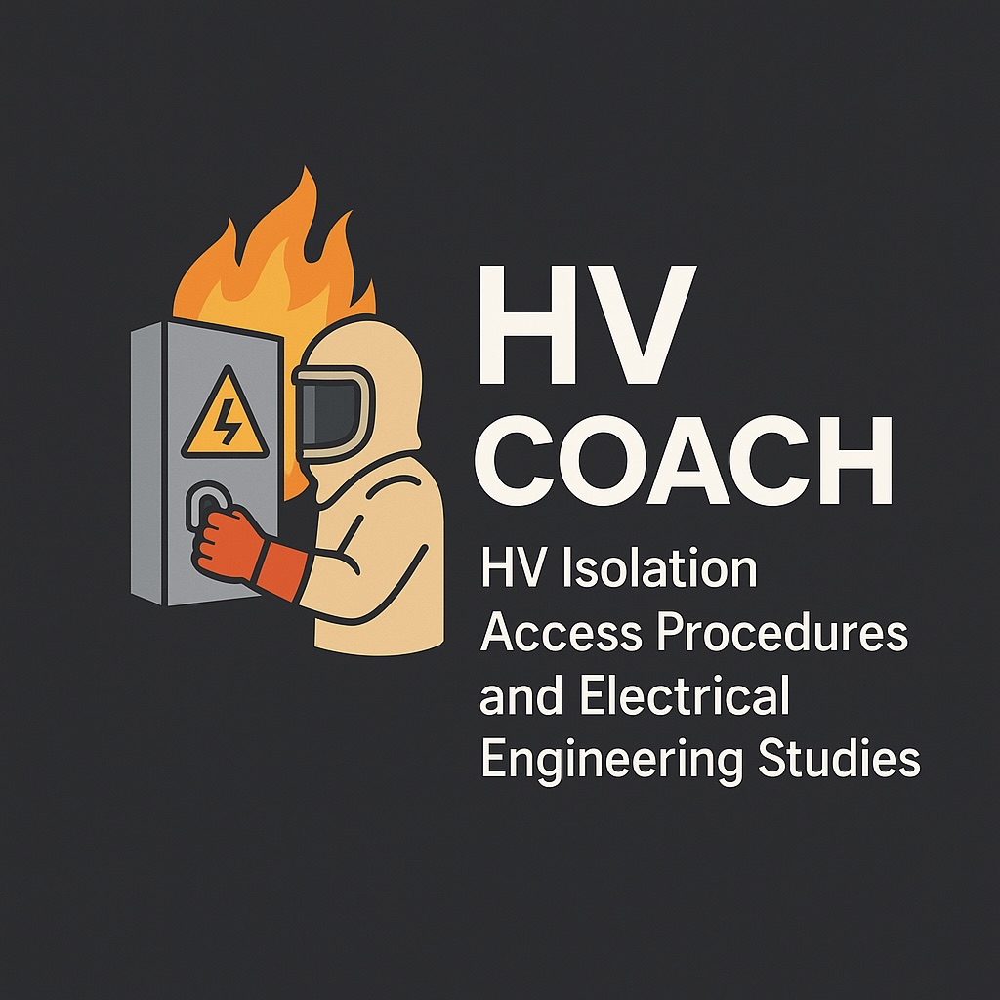

# High Voltage Switching Program Creator



## Overview

The HV Switching Program Creator is a specialized web application designed for electrical engineers, technicians, and operators to create, edit, and manage high voltage switching programs. It provides an intuitive spreadsheet-like interface that simplifies the complex task of creating detailed switching sequences for high voltage electrical equipment.

Currently deployed at https://ma-fs.github.io/hv-switching-advanced /

## Key Features

- **Dynamic Row Management**: Add, delete, and reorder rows with drag-and-drop functionality
- **Real-time Collaboration**: Auto-save functionality ensures work is never lost
- **Reverse Section Support**: Automatically create and manage reverse sequences
- **PDF Export**: Generate professional PDF documents with custom formatting
- **Program Management**: Save, load, and manage multiple switching programs
- **Responsive Design**: Works on desktop and tablet devices
- **Intuitive Controls**: Insert rows above or below, copy from above, and more

## Getting Started

### Installation

1. Clone the repository
   ```
   git clone https://github.com/your-repo/hv-switching-advanced.git
   cd hv-switching-advanced
   ```

2. Install dependencies:
   ```
   cd switching-program
   npm install
   ```

3. Start the application:
   ```
   npm start
   ```

4. Open the application in your browser (usually at `http://localhost:3000`)

## Tips for Developing HV Switching Programs

### 1. Program Planning

- **Start with a Clear Objective**: Define the purpose of the switching operation before creating steps
- **Reference Equipment Diagrams**: Always have up-to-date single-line diagrams available
- **Follow Standard Sequences**: Use industry-standard sequences for common operations (isolation, earthing, etc.)
- **Consider Safety First**: Plan verification steps at critical points in the program

### 2. Using the Application Effectively

- **Form Information**: Fill out all form fields at the top for proper documentation
- **Use Consistent Terminology**: Maintain consistent naming conventions for equipment
- **Item Numbering**: The application automatically handles item numbering, even through reverse sections
- **Column Organization**:
  - **Operator**: Person responsible for the specific step
  - **Location**: Physical location where the action takes place
  - **kV**: Voltage level of the equipment being operated
  - **Type**: Type of equipment (CB, DS, ES, etc.)
  - **Label**: Unique identifier for the equipment
  - **Instruction**: Detailed description of the action
  - **Time**: When the action was completed
  - **Initial**: Operator's initials after completing the action

### 3. Advanced Features

- **Reverse Sections**: Use the "Reverse" button to automatically create the reverse sequence of operations
- **Creating Complex Programs**:
  - For parallel operations, create clear demarcations between different paths
  - Use the insert function to add verification steps at key points
  - Export to PDF for review before finalizing
- **Managing Multiple Programs**: 
  - Save programs with descriptive names
  - Use the program management features to organize and retrieve programs

### 4. Best Practices for HV Switching

- **Verification Steps**: Include verification steps between critical operations
- **Lock-Out Tag-Out (LOTO)**: Document application and removal of locks and tags
- **Communication Points**: Identify when operators need to communicate with others
- **Test Points**: Include voltage testing steps before earthing
- **Emergency Procedures**: Include steps for handling abnormal situations

### 5. PDF Export Tips

- The export feature creates professional PDFs with:
  - Company logo and program title on each page
  - Form data displayed at the top of the first page
  - Table contents with appropriate formatting
  - "REVERSE" text clearly highlighted
  - Page numbers in the footer
- Filename format: `preparedby_program_programno_date.pdf`

## Program Structure

A typical HV switching program follows this structure:

1. **Header Information**: Program details, preparation/authorization information
2. **Pre-switching Checks**: Safety preparations and equipment checks
3. **Isolation Sequence**: Steps to isolate the equipment
4. **Earthing Sequence**: Steps to apply safety earths
5. **Work Permit**: Issuance of work permit
6. **Reverse Section**: Steps to return equipment to service
   - Remove earths
   - Remove isolation
   - Restore normal configuration

## Contributing

We welcome contributions to improve this tool. Please feel free to submit issues or pull requests.

## License

This project is licensed under the MIT License.

Copyright (c) 2024 MA-FS
